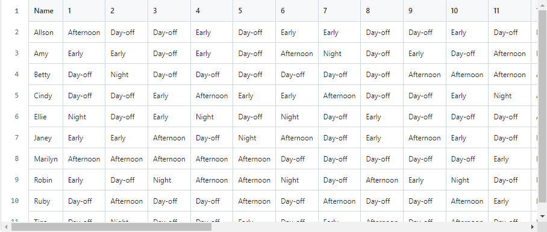
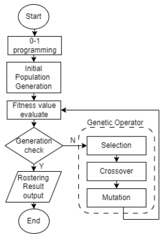
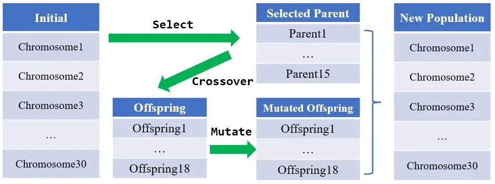
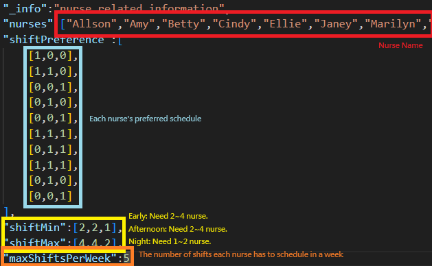
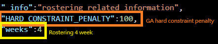
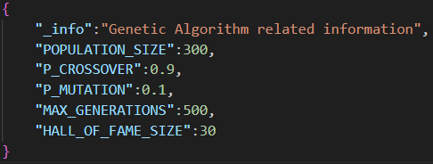
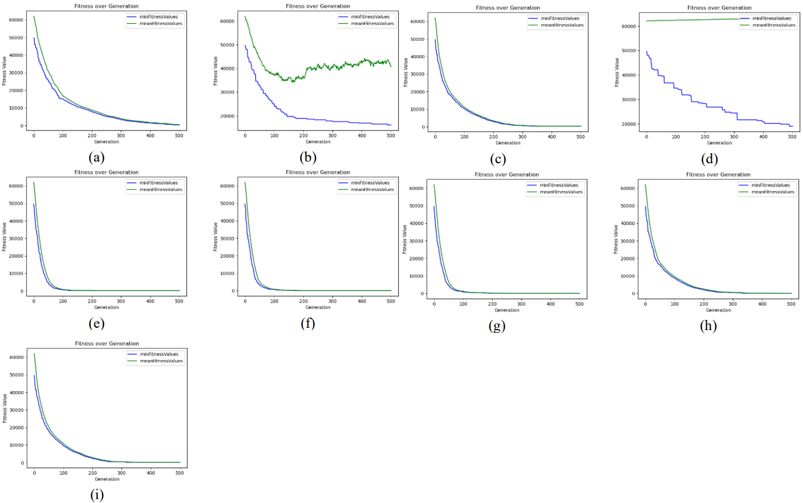

#  Genetic Algorithm for Nurse Rostering & Scheduling

This project applies a genetic algorithm to solve the **NP-hard nurse rostering problem**, minimizing patient wait times and staff overtime while complying with real-world constraints.

<p align="center">
  
</p>

 For full technical details, see the [Final Paper](https://github.com/JianJiaXian/GA_Nurse_Rostering/blob/main/Final_Project_Paper.pdf)

---

##  Problem Description

Operating room scheduling differs from general ward scheduling due to:
- Uncertainty in patient operations
- Required prioritization of surgeries
- Staffing and rest regulations

Hospitals often rely on manual experience for shift planning, which may lead to:
- Long patient wait times
- Excessive staff overtime
- Suboptimal satisfaction and performance

<p align="center">
  
</p>

---

##  Genetic Representation

### Binary Encoding

Each shift is encoded as a 3-bit vector:

| Shift | Binary Code | Time           |
|-------|-------------|----------------|
| Early | [1, 0, 0]   | 07:00–15:00    |
| Afternoon | [0, 1, 0] | 15:00–23:00 |
| Night | [0, 0, 1]   | 23:00–07:00    |
| Off   | [0, 0, 0]   | —              |

<p align="center">
  
</p>

---

##  Constraints

###  Hard Constraints
1. A nurse can only work one shift per day.
2. No consecutive shifts allowed (e.g., afternoon + night).
3. At least **2 days off** per nurse per week.
4. **Minimum staff per shift**:
   - Early: 2–4
   - Afternoon: 2–4
   - Night: 1–2

###  Soft Constraints
- Nurse preferences (see input data format)

---

##  Input Data Example

### Nurse Info

<p align="center">
  
</p>

### Rostering Info

<p align="center">
  
</p>

### GA Config

<p align="center">
  
</p>

---

##  GA Process Flow

<p align="center">
  
</p>

---

##  Experimental Results

We compare multiple configurations using different combinations of selection, crossover, and mutation strategies.

<p align="center">
  
</p>

### Best Configuration:
- Selection: **Fitness Best**
- Crossover: **Uniform (0.7)**
- Mutation: **FlipBit**

This combination achieved:
- **Min Fitness**: 8.0
- **Mean Fitness**: 17.67

---

##  Final Output

We generate a 31-day shift schedule and export the results in Excel format for easy reference by each nurse.
see the [Final Results](https://github.com/JianJiaXian/GA_Nurse_Rostering/blob/main/solution.csv)

---

##  How to Run

```bash
pip install deap seaborn
python rostering.py
```

---

##  Future Work

1. Extend to multi-objective optimization.
2. Support real-time scheduling and emergencies.
3. Improve fitness functions with more real-world variables.

---

##  References

- T.C. Wong et al., *Nurse Scheduling in ED*, 2014.
- Ziyi Chen et al., *Neural Rostering*, 2022.
- H. Kawanaka et al., *GA with Constraints for Nurse Scheduling*, 2001.
